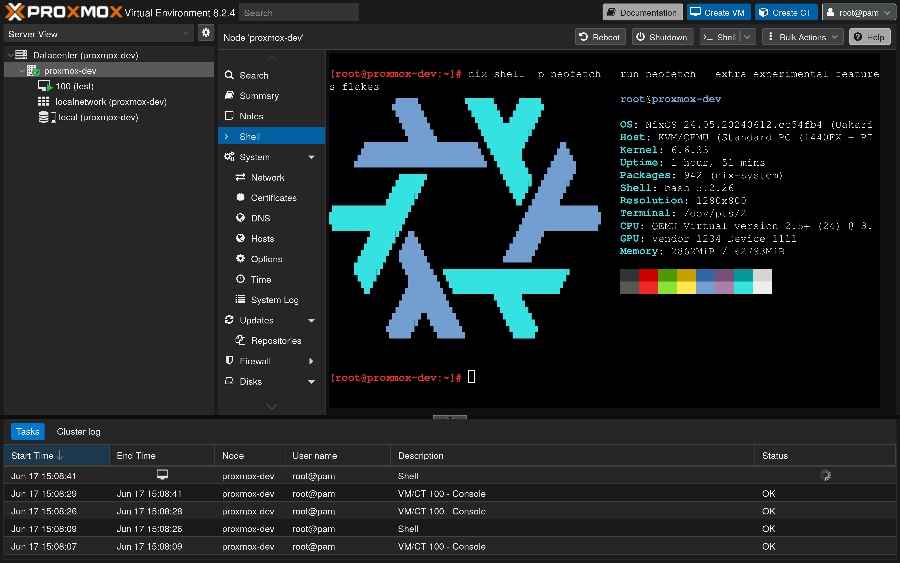

# Proxmox on NixOS



This project is a port of the [Proxmox Hypervisor](https://www.proxmox.com/) on NixOS.

⚠️ Proxmox-NixOS is still **experimental** and we do not advise running it on production machines. Do it at your own risk and only if you are ready to fix issues by yourself.

## 🚦 Supported features

Proxmox-NixOS has been tested on real hardware with most basic features of Proxmox (booting VMs, user management, etc), more involved setups (clusters, HA, etc) are still under development and testing.

## 🗃️ Cache

Some Proxmox packages have a quite power intensive build process. We make a cache available to download directly the artifacts:
- address: `https://cache.saumon.network/proxmox-nixos`
- public key: `proxmox-nixos:nveXDuVVhFDRFx8Dn19f1WDEaNRJjPrF2CPD2D+m1ys=`

## 🚀 Quick start

### With [`npins`](https://github.com/andir/npins)

#### To enable npins
first add npins as systemPackage or `nix-shell -p npins`
then initialize npins in /etc/nixos
```bash
cd /etc/nixos
sudo npins init
sudo npins add github SaumonNet proxmox-nixos -b main
```


```

Add `proxmox-nixos` as a dependency of your npins project.

```console
$ npins add github SaumonNet proxmox-nixos -b main
[INFO ] Adding 'proxmox-nixos' …
    repository: https://github.com/SaumonNet/proxmox-nixos.git
    branch: main
    revision: ...
    url: https://github.com/saumonnet/proxmox-nixos/archive/$revision.tar.gz
    hash: ...
```

Below is a fragment of a NixOS configuration that enables Proxmox VE.

```nix
# file: configuration.nix
{  config, pkgs, lib, ... }:
let
    sources = import ./npins;
    proxmox-nixos = import sources.proxmox-nixos;
in
{
  imports = [ ./hardware-configuration.nix proxmox-nixos.nixosModules.proxmox-ve ];
  services.proxmox-ve.enable = true;
  nixpkgs.overlays = [
    proxmox-nixos.overlays.x86_64-linux
  ];
  # The rest of your configuration...
}
```

### With Flakes

Below is a fragment of a NixOS configuration that enables Proxmox VE.

```nix
{
  description = "A flake with Proxmox VE enabled";

  inputs = {
    nixpkgs.url = "github:NixOS/nixpkgs/nixos-unstable";
    proxmox-nixos.url = "github:SaumonNet/proxmox-nixos";
  };

  outputs = { self, nixpkgs, proxmox-nixos, ...}: {
    nixosConfigurations = {
      yourHost = nixpkgs.lib.nixosSystem rec {
        system = "x86_64-linux";
        modules = [

          proxmox-nixos.nixosModules.proxmox-ve

          ({ pkgs, lib, ... }: {
            services.proxmox-ve.enable = true;
            nixpkgs.overlays = [
              proxmox-nixos.overlays.${system}
            ];

            # The rest of your configuration...
          })
        ];
      };
    };
  };
}
```

## 🌐 Networking

To get internet in your VMs, you need to add a network device to the VM, connected to a bridge. To get this working, follow this 2 steps:
1) Create the bridge in `System->Network->Create->Linux Bridge`. This operation has no effect on your system and is just a quirk for Proxmox to know the existence of your bridge.
2) Configure your networking through NixOS configuration so that the bridge you created in the Proxmox web interface actually exists!

### Example NixOS networking configurations

Any kind of advanced networking configuration is possible through the usual NixOS options, but here are basic examples that can get you started:

#### With `systemd-networkd`

```nix
systemd.network.networks."10-lan" = {
    matchConfig.Name = [ "ens18" ];
    networkConfig = {
    Bridge = "vmbr0";
    };
};

systemd.network.netdevs."vmbr0" = {
    netdevConfig = {
        Name = "vmbr0";
        Kind = "bridge";
    };
};

systemd.network.networks."10-lan-bridge" = {
    matchConfig.Name = "vmbr0";
    networkConfig = {
    IPv6AcceptRA = true;
    DHCP = "ipv4";
    };
    linkConfig.RequiredForOnline = "routable";
};
```

### With scripted networking

```nix
networking.bridges.vmbr0.interfaces = [ "ens18" ];
networking.interfaces.vmbr0.useDHCP = lib.mkDefault true;
```

## 🚧 Roadmap

- Support for clusters / HA with Ceph
- More coverage of NixOS tests
- Proxmox backup server

## 🔧 Maintainance

Most packages are regularly and automatically updated thanks to [a modified version](https://github.com/SaumonNet/proxmox-nixos-update) of the [`nixpkgs-update`](https://github.com/nix-community/nixpkgs-update) bot, whose logs are available [here](https://proxmox-nixos-update-logs.saumon.network/).

## 📬 Help / Discussions

There is [a matrix room](https://matrix.to/#/#proxmox-nixos:matrix.org) for discussions about Proxmox-NixOS.

## Thanks

This project has received support from [NLNet](https://nlnet.nl/).
<pre>     </pre>
